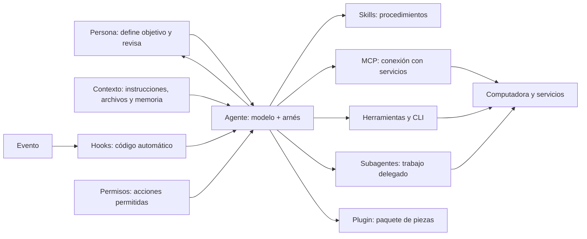

# El mapa del entorno de un agente: qué es cada pieza y cuándo usarla

## Qué vas a lograr

Al terminar, podrás reconocer qué pieza resuelve una necesidad y decidir cuándo no agregar nada. La idea del taller: el modelo es una persona capaz que llega a un escritorio nuevo; el contexto le explica el trabajo, las herramientas le permiten actuar y el objetivo marca qué debe lograr. El arnés es el entorno que coordina ese ciclo. *(docs-oficiales: Claude Code, [cómo trabaja](https://code.claude.com/docs/en/how-claude-code-works); [glosario](https://code.claude.com/docs/en/glossary); Codex, [AGENTS.md](https://learn.chatgpt.com/docs/agent-configuration/agents-md)).*

Estas piezas cambian con las versiones. Esta guía se redactó el **2026-09-30**. Los comandos observados en terminal corresponden a esta computadora y no garantizan lo que ofrece otra instalación.

## La escena completa

El diagrama muestra un modelo mental, no una arquitectura idéntica para cada producto. Una skill o un plugin pueden existir sin MCP; un plugin agrupa piezas, no las reemplaza conceptualmente. *(docs-oficiales: [plugins Claude Code](https://code.claude.com/docs/en/plugins/overview), [plugins Codex](https://learn.chatgpt.com/docs/plugins)).*

## Las piezas y su costo típico

Piensa en las instrucciones como la carpeta de inducción del empleado; las skills como procedimientos que consulta cuando corresponde; y las herramientas y accesos como programas y llaves. Un hook es una automatización que se activa por un evento. El plugin es un paquete de componentes. Los permisos delimitan lo que ese entorno deja hacer.

<TablaCostos />

Las categorías de costo son cualitativas: **siempre**, **al usarla**, **aislado** o **ninguno**. En algunas herramientas pueden cargarse nombres y descripciones antes de abrir el contenido completo; la tabla simplifica ese comportamiento y no compara cantidades. *(docs-oficiales: [skills Claude Code](https://code.claude.com/docs/en/skills), [skills Codex](https://learn.chatgpt.com/docs/build-skills), [plugins Claude Code](https://code.claude.com/docs/en/plugins/overview)).*

## ¿Qué pieza necesito?

1. **Una regla que debe orientar el trabajo en general:** instrucciones de proyecto. Claude Code lee `CLAUDE.md`; Codex usa `AGENTS.md`. Por ejemplo: “en este proyecto, guarda los informes en la carpeta Informes”. Son contexto e instrucciones; no garantizan que cada instrucción se obedezca ni sustituyen permisos. *(docs-oficiales: [memoria de Claude Code](https://code.claude.com/docs/en/memory), [AGENTS.md de Codex](https://learn.chatgpt.com/docs/agent-configuration/agents-md)).*
2. **Un procedimiento útil de vez en cuando:** skill. Por ejemplo, una secuencia para preparar una minuta con un formato habitual. El contenido puede cargarse al usarlo, según la herramienta. *(docs-oficiales: [skills Claude Code](https://code.claude.com/docs/en/skills), [skills Codex](https://learn.chatgpt.com/docs/build-skills)).*
3. **Llegar a un sistema externo:** primero revisa si una CLI existente resuelve la tarea con claridad. Si necesitas una conexión interoperable que exponga herramientas o datos, evalúa MCP. Por ejemplo, consultar un calendario puede hacerse con su CLI disponible o con un servidor MCP aprobado. *(docs-oficiales: [MCP Claude Code](https://code.claude.com/docs/en/mcp), [MCP Codex](https://learn.chatgpt.com/docs/extend/mcp)).*
4. **Algo que debe ocurrir ante un evento concreto:** hook. Por ejemplo, ejecutar un formato automático al guardar un archivo. Un hook ejecuta código configurado; no es una sugerencia redactada para el modelo. *(docs-oficiales: [hooks Claude Code](https://code.claude.com/docs/en/hooks-guide), [plugins Codex](https://learn.chatgpt.com/docs/plugins)).*
5. **Investigar un tema amplio sin llenar el contexto principal:** subagente, si tu entorno permite delegar con una ventana propia. Por ejemplo, pedirle que revise varios documentos y devuelva un resumen con referencias. *(docs-oficiales: [subagentes Claude Code](https://code.claude.com/docs/en/sub-agents)).*
6. **Distribuir un conjunto coherente de componentes:** plugin, cuando el paquete resuelve una necesidad identificable y su origen es confiable. *(docs-oficiales: [plugins Claude Code](https://code.claude.com/docs/en/plugins/overview), [plugins Codex](https://learn.chatgpt.com/docs/plugins)).*
7. **Controlar si una acción se permite:** permisos. Por ejemplo, permitir lectura del proyecto y pedir autorización antes de modificar archivos o conectarse a un servicio externo. *(docs-oficiales: [permisos Claude Code](https://code.claude.com/docs/en/permissions); [seguridad Codex](https://learn.chatgpt.com/docs/plugins)).*

<AntesDeInstalar que="Un plugin puede combinar instrucciones, código y accesos externos. Antes de incorporarlo, revisa qué problema resuelve, qué trae y qué permisos necesita." />

La misma necesidad puede resolverse con más de una pieza. Elige la más pequeña que puedas explicar: si no puedes nombrar el problema concreto que resuelve, no hace falta agregarla todavía.

## Dónde vive cada cosa

Las rutas siguientes describen ubicaciones documentadas, no la lista de lo que tienes en tu equipo. `$HOME` representa tu carpeta de usuario: en Windows suele ser `%USERPROFILE%`. Los ajustes administrados por una organización dependen del sistema operativo y de sus políticas. *(docs-oficiales: [directorio de Claude Code](https://code.claude.com/docs/en/claude-directory), [skills Codex](https://learn.chatgpt.com/docs/build-skills), [MCP Codex](https://learn.chatgpt.com/docs/extend/mcp)).*

| Alcance | Claude Code | Codex |
| --- | --- | --- |
| Proyecto, compartible con el equipo | `CLAUDE.md`, `.claude/`, `.mcp.json` en la raíz | `AGENTS.md`, `.agents/skills/`; MCP del proyecto en `.codex/config.toml` cuando el proyecto es de confianza |
| Proyecto, preferencia local | `CLAUDE.local.md`, `.claude/settings.local.json` | No hay un equivalente único documentado para todas estas piezas; revisa archivos locales y configuración del proyecto |
| Usuario, entre proyectos | macOS/Linux: `~/.claude/`; Windows: `%USERPROFILE%\.claude\` | Skills: `$HOME/.agents/skills/`; configuración y MCP: `$HOME/.codex/config.toml` |
| Organización o sistema | Ajustes administrados: ruta y política dependen de la organización y del sistema | Skills administradas: `/etc/codex/skills` en sistemas que usan esa ubicación; otras políticas dependen del despliegue |

Los nombres exactos de subcarpetas dependen de la pieza. Por ejemplo, las skills de Claude Code viven en `skills/<nombre>/SKILL.md` dentro del alcance correspondiente; en Codex, cada skill tiene su propia carpeta bajo `.agents/skills/`. No copies una ruta de un tutorial sin confirmar la versión y el alcance. *(docs-oficiales: [directorio Claude](https://code.claude.com/docs/en/claude-directory), [skills Codex](https://learn.chatgpt.com/docs/build-skills)).*

## Mira qué tienes activo hoy

Abre primero la ayuda o documentación de tu versión. En una sesión interactiva, estos son lugares documentados para consultar; el resultado depende de tu instalación y configuración. No los ejecutes a ciegas: algunos diagnósticos pueden ofrecer correcciones.

| Herramienta / consulta | Qué observar | Evidencia |
| --- | --- | --- |
| Claude Code `/context` | Qué ocupa el contexto actual y si hay advertencias | docs-oficiales |
| Claude Code `/skills` | Skills disponibles en la sesión | docs-oficiales |
| Claude Code `/mcp` | Servidores y herramientas MCP disponibles | docs-oficiales |
| Claude Code `/hooks` | Hooks configurados para eventos de herramientas | docs-oficiales |
| Claude Code `/plugin` | Plugins disponibles/instalados y activación | docs-oficiales |
| Claude Code `/memory` | Instrucciones y memoria automática | docs-oficiales |
| Claude Code `/doctor` o terminal `claude doctor` | Problemas de configuración; `/doctor` puede proponer o aplicar arreglos, `claude doctor` entrega diagnóstico de instalación | docs-oficiales; versión local 2.1.285 |
| Claude Code `/skill-doctor` | Uso y costo de skills cuando la función está disponible | docs-oficiales; requiere condiciones de versión y función habilitada |
| Codex `/skills`, `/plugins`, `/mcp` | Skills/plugins visibles y servidores MCP; la ayuda local confirmó los subcomandos CLI `codex mcp list` y `codex plugin list` | Documentación oficial y CLI local 0.159.0 |
| Codex hooks y memoria | Revisa plugin, configuración y archivos de instrucciones; no confirmé un comando único de inspección equivalente | no-verificada |

**Salida real de inspección en esta computadora (2026-09-30):** `claude --version` informó `2.1.285 (Claude Code)`; `codex --version` informó `codex-cli 0.159.0`. `claude mcp --help` mostró el propósito de configurar y gestionar servidores MCP; `claude plugin --help` mostró gestión de plugins. `codex mcp --help` listó `list`, `get`, `add`, `remove`, `login` y `logout`; `codex plugin --help` listó `add`, `list`, `marketplace` y `remove`. Esto es evidencia **ejecutada** para la ayuda CLI de esta máquina, no para el contenido de una sesión interactiva ni para otros equipos. La salida de `codex --version` también mostró una advertencia de que no pudo crear alias en `PATH` por no encontrar el directorio home; no afecta la versión impresa.

Claude Code documenta `/context`, `/skills`, `/mcp`, `/hooks`, `/plugin`, `/memory`, `/doctor` y `/skill-doctor`. El último puede depender de la obtención de funciones habilitadas. La opción de terminal `claude doctor` imprime diagnóstico de instalación; `/doctor` dentro de la sesión puede ofrecer cambios, así que revisa el plan antes de aceptar. Codex documenta los comandos de sesión `/skills`, `/plugins` y `/mcp`; en su CLI local también se inspeccionan listas con `codex mcp list` y `codex plugin list`. No afirmo que Codex carezca de herramientas adicionales de memoria/hooks: aquí solo queda **no verificado** un equivalente universal para la lista indicada. *(docs-oficiales: [comandos Claude Code](https://code.claude.com/docs/en/commands), [comandos Codex](https://learn.chatgpt.com/docs/developer-commands); ejecutada: versión y ayuda CLI local).* 

## Una configuración pequeña para empezar

**Para estudiante:** inicia con una instrucción de proyecto que explique la carpeta de práctica y el formato de entrega. Añade una skill solo si repites un procedimiento. Usa las herramientas que ya tienes disponibles y deja servicios externos desconectados si no los necesitas.

**Para desarrollador:** empieza con instrucciones del repositorio y permisos limitados al proyecto. Si una tarea repetida necesita una secuencia, documenta primero los pasos y luego considera una skill. Si un evento necesita una acción obligatoria y revisable, evalúa un hook pequeño. Delega una investigación larga a un subagente solo si realmente separa trabajo.

No hay premio por tener más piezas. Mantener la carpeta de inducción breve y concreta ayuda a que el agente ubique lo relevante; la longitud exacta es una decisión de equipo, no una cifra oficial universal.

## Permisos en una página

Un permiso es una frontera de decisión: qué puede hacer el agente automáticamente y para qué debe detenerse a preguntarte. Claude Code documenta modos de permiso y reglas que permiten, preguntan o deniegan acciones. Codex combina una política de aprobaciones con un sandbox que limita el acceso a archivos y red; las opciones dependen del cliente y configuración. Revisa la configuración efectiva antes de trabajar con archivos importantes o servicios. *(docs-oficiales: [permisos Claude Code](https://code.claude.com/docs/en/permissions), [seguridad y aprobaciones Codex](https://learn.chatgpt.com/docs/agent-approvals-security), [modos de permiso Codex](https://learn.chatgpt.com/docs/permission-modes)).*

- **Pedir confirmación:** conveniente cuando la acción puede cambiar archivos, publicar, enviar o eliminar algo.
- **Planificar primero:** solicita el plan, revísalo y después autoriza acciones concretas. Un plan ayuda a entender la intención, pero por sí solo no limita el acceso.
- **Aprobar automáticamente:** resérvalo para un entorno acotado y acciones que ya entiendes, con copias o recuperación disponibles.
- **Aprobar todo:** no es una configuración inicial razonable; si el modelo interpreta mal una instrucción, los permisos amplios pueden agrandar el daño.

Los nombres de los modos cambian entre herramientas. No asumas que “plan”, “auto” o “default” significan lo mismo en cada producto; usa la documentación del cliente y versión que tengas.

## Qué deberías poder hacer ahora

- Explicar con un ejemplo la diferencia entre instrucciones, una skill y una conexión MCP.
- Elegir qué pieza usarías para una regla del proyecto, un procedimiento ocasional y una acción obligatoria al guardar.
- Encontrar en la ayuda de tu herramienta cómo revisar sus permisos y qué componentes están disponibles.

## Mitos frecuentes

### “Skill, plugin y MCP son lo mismo”

No: la skill ofrece un procedimiento, MCP conecta con herramientas/datos y el plugin empaqueta componentes. Un plugin puede incluir skills o MCP, pero no son equivalentes. *(docs-oficiales: [plugins Claude Code](https://code.claude.com/docs/en/plugins/overview)).*

### “Un plugin siempre es más seguro que copiar archivos”

El formato de paquete no demuestra seguridad. Comprueba origen, contenido, permisos y acciones. Un hook o una herramienta MCP pueden actuar con tus accesos. *(docs-oficiales: [seguridad de plugins Claude Code](https://code.claude.com/docs/en/plugins/security), [plugins Codex](https://learn.chatgpt.com/docs/plugins)).*

### “Todo lo que aparece en un tutorial debería estar instalado”

No. Cada pieza agrega una responsabilidad de mantenimiento y, a veces, acceso a datos o ejecución de código. Si no puedes explicar qué problema resuelve, no la agregues.

### “Los hooks son instrucciones para el modelo”

No: un hook es una acción configurada para un evento del ciclo del agente. Una instrucción le comunica al modelo cómo trabajar; el hook ejecuta lógica en el entorno. *(docs-oficiales: [hooks Claude Code](https://code.claude.com/docs/en/hooks-guide), [plugins Codex](https://learn.chatgpt.com/docs/plugins)).*

## Sigue aprendiendo

- [Qué es el contexto y cómo cuidarlo](/guias/contexto-que-es-y-como-cuidarlo)
- [CLAUDE.md, skills y memoria automática en Claude Code](/guias/obsidian-claude-md-skills-memoria) — ejemplo de la pista de conocimiento.
- [Qué es MCP y cómo elegirlo](/guias/qgis-mcp-que-es-y-como-elegir) — caso aplicado a QGIS.
- [Plugins de QGIS: instalar y gestionar](/guias/qgis-plugins-instalar-y-gestionar) — QGIS, no plugins de agentes.
- [Antes de instalar: evaluar con criterio](/guias/antes-de-instalar-evaluar-con-criterio)
