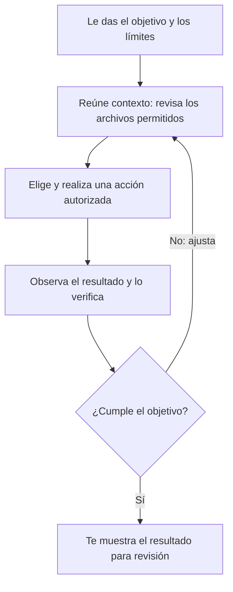

# Qué es un agente de IA (y en qué se diferencia de un chat)

## Qué vas a entender

En unos 20 minutos vas a poder distinguir entre conversar con un modelo y darle a un agente una tarea que puede investigar y realizar con herramientas. No necesitás saber programar: alcanza con observar qué información tiene, qué acciones puede hacer y cómo comprobás el resultado.

Imaginá que necesitás ordenar 30 facturas ficticias en carpetas y preparar un resumen. En un chat común, describís la tarea y recibís ideas o texto; vos abrís, clasificás y renombrás los archivos. Un agente con acceso autorizado a una carpeta de práctica podría revisar los documentos, proponer una organización, hacer cambios permitidos y mostrarte el resultado. Que tenga esa capacidad no significa que siempre acierte ni que debás aprobar cualquier acción.

## Cuatro ingredientes: una persona nueva en el trabajo

Pensá en un agente como una persona capaz que acaba de llegar al equipo. Para hacer una tarea necesita saber algo, tener información a mano, contar con programas y entender qué resultado buscás.

| Ingrediente | Analogía | Qué significa |
|---|---|---|
| Modelo | La persona capaz | Interpreta instrucciones y propone próximos pasos usando patrones aprendidos. Puede equivocarse o no saber algo. |
| Contexto | El escritorio y la carpeta del caso | Conversación, instrucciones y la información que se le muestra, como archivos o resultados de herramientas. |
| Herramientas | Los programas de trabajo | Acciones disponibles, por ejemplo buscar o leer archivos, editar un documento o ejecutar una operación. |
| Objetivo | El encargo | El resultado que le pedís, idealmente con límites y una forma de revisar si quedó bien. |

La analogía ayuda a orientarse, pero tiene límites: un modelo no es una persona y no comprende el mundo como un ser humano. “Contexto” tampoco quiere decir que el agente conozca todo lo que hay en la computadora. Solo puede usar la información que la herramienta le presenta y las acciones que tiene habilitadas.

## Tres formas de resolver una tarea

### 1. Una tarea puntual: chat

Le hacés una pregunta o le pedís un borrador. El modelo responde en texto y vos decidís qué hacer con esa respuesta. Es suficiente si solo necesitás ideas, una explicación o ayuda para redactar.

### 2. Un flujo de trabajo: pasos fijos

La tarea sigue un recorrido predefinido: por ejemplo, recibir una factura, extraer tres campos, comprobar que estén presentes y guardarlos en un formato común. Si el procedimiento se repite y las reglas son previsibles, suele ser mejor un flujo fijo o un script revisado. Sabés de antemano qué pasos ejecuta.

### 3. Un agente: elige los pasos

El agente recibe un objetivo, observa lo que ocurre y decide qué herramienta o paso usar después. Según [Anthropic, la diferencia de arquitectura](https://www.anthropic.com/engineering/building-effective-agents) es que un flujo usa rutas de código predefinidas y un agente dirige dinámicamente su proceso y uso de herramientas. En la práctica, los productos pueden combinar ambas formas.

| Forma | Quién determina los pasos | Conviene cuando… |
|---|---|---|
| Chat | Vos, después de leer la respuesta | Querés una explicación, una idea o un texto para revisar. |
| Flujo fijo | El procedimiento ya está definido | El trabajo se repite y las entradas y comprobaciones son previsibles. |
| Agente | El modelo elige pasos entre las herramientas permitidas | Hay que adaptarse a lo que se descubre y se puede revisar el resultado. |

No todo necesita un agente. Cuanta más libertad para decidir y actuar, más importante es acotar el objetivo y comprobar el trabajo.

## El ciclo de trabajo

La documentación de Claude Code describe tres fases que pueden repetirse: reunir contexto, actuar y verificar resultados. Podés interrumpir y redirigir el proceso. [La guía oficial explica el ciclo y las herramientas](https://code.claude.com/docs/en/how-claude-code-works); otros productos pueden mostrarlo de otra manera.

Ejemplo: ordenar facturas de práctica, con nombres inventados y sin datos personales.

| Fase | Qué podría pasar en la pantalla |
|---|---|
| Reunir contexto | El agente explica qué carpeta revisará o muestra una búsqueda. |
| Actuar | Aparece una propuesta o una solicitud de permiso para crear carpetas o mover archivos. |
| Verificar | Muestra los nombres resultantes, un resumen y cualquier duda o elemento que no pudo clasificar. |
| Repetir o cerrar | Le indicás una corrección, o revisás el resultado y decidís si está listo. |

Son ejemplos de lo que podrías observar, no una promesa de que todas las herramientas enseñen cada paso. Definí desde el inicio que el agente trabaje con copias, proponga antes de mover y deje sin tocar los casos dudosos.

## El modelo y el arnés no son lo mismo

El **modelo** interpreta el encargo y decide qué paso proponer. El **arnés** —la aplicación que lo rodea— le entrega contexto, conecta herramientas y coordina el ciclo. [Claude Code describe su aplicación como la capa que aporta herramientas y gestiona el contexto](https://code.claude.com/docs/en/how-claude-code-works). La documentación de [Codex también separa el agente, su entorno y la sesión](https://learn.chatgpt.com/docs/agent-approvals-security).

Por eso el mismo tipo de modelo puede comportarse distinto en dos aplicaciones: una podría solo responder texto, y otra podría permitirle buscar archivos o editar dentro de una carpeta. La lista de herramientas, las instrucciones y los permisos cambian lo que el agente puede hacer. Eso no demuestra que un modelo sea más inteligente.

Un **permiso** define qué acciones se pueden hacer y bajo qué condiciones. Según la configuración, la aplicación puede detenerse y preguntarte antes de editar archivos, ejecutar ciertos comandos o salir del espacio autorizado. [La documentación de permisos de Codex](https://learn.chatgpt.com/docs/permissions) describe estas fronteras. Aceptá una solicitud solo si entendés qué acción propone, sobre qué elemento y con qué consecuencia.

El **contexto** es la información que el agente tiene disponible durante el trabajo. En Claude Code, por ejemplo, la documentación enumera conversación, contenidos de archivos leídos, resultados de comandos, instrucciones de proyecto, memoria cargada, skills y mensajes del sistema. Cada sesión nueva puede comenzar sin el historial de la anterior; algunas herramientas permiten guardar o resumir información aparte. Consultá la documentación de la herramienta concreta antes de confiar en que recordará algo.

## Para qué puede servir y dónde necesitás tu criterio

Un agente puede ser útil cuando los pasos dependen de lo que encuentre y existe una manera clara de revisar el resultado: reunir documentos de práctica, proponer categorías y señalar dudas. Es menos adecuado cuando el resultado depende de una decisión humana importante, cuando no podés verificarlo o cuando un error sería difícil de revertir.

No le des datos que no sean necesarios para la tarea. Si usás un servicio con un modelo remoto, el contenido que le enviás se procesa según el servicio y su configuración; que un archivo esté guardado en tu computadora no significa que el contenido enviado al modelo permanezca ahí. Revisá las políticas de privacidad y las opciones de datos de la herramienta antes de compartir información. Claude Code puede leer archivos autorizados y enviar el contexto necesario al modelo; no asumás que todos los archivos locales se transmiten automáticamente.

<Callout type="peligro" title="Protegé los archivos y las decisiones">
  Para practicar, usá una carpeta aparte con copias y documentos ficticios. No incluyás expedientes, datos personales ni información confidencial. Limitá los permisos, revisá cada cambio y conservá un respaldo. Un agente puede interpretar mal instrucciones o archivos y hacer cambios no deseados. La responsabilidad de revisar el resultado sigue siendo tuya.
</Callout>

Si una herramienta propone instalar una extensión o conectar un servicio, primero evaluá si realmente hace falta y qué acceso pide:

<AntesDeInstalar que="una extensión o conexión para tu agente" />

Además, verificá quién publica el complemento y qué puede leer o cambiar. Preferí fuentes confiables, entendé cómo desactivarlo y empezá con el acceso mínimo. Las etiquetas “oficial” o “popular” por sí solas no garantizan que algo sea seguro.

## Cómo empezar con cuidado

1. Elegí una tarea pequeña, reversible y fácil de comprobar. Por ejemplo, agrupar tres archivos ficticios en una carpeta de práctica.
2. Prepará copias de respaldo y no uses documentos sensibles.
3. Indicá el objetivo, qué carpeta puede usar y qué debe dejar sin tocar.
4. Pedí que describa un plan antes de actuar y que pregunte si encuentra algo dudoso.
5. Revisá el plan y cada solicitud de permiso. Después, compará los archivos con el respaldo y confirmá por tu cuenta el resultado.

## Siguientes guías

- [Glosario de agentes de IA](/glosario) — la página está pendiente de publicación.
- [Trabajar con un agente dentro de una bóveda de Obsidian, sin programar](/guias/obsidian-agente-sin-programar)
- [Entender instrucciones, skills y memoria con Claude Code](/guias/obsidian-claude-md-skills-memoria)
- Antes de instalar o conectar herramientas, revisá la [guía de evaluación con criterio](/guias/antes-de-instalar-evaluar-con-criterio). Si aún no está publicada, guardá este enlace para más adelante.

## Fuentes consultadas

Consulta de documentación oficial: 2026-09-30. Los conceptos pueden variar según el producto, la interfaz y su configuración.

- [Cómo funciona Claude Code](https://code.claude.com/docs/en/how-claude-code-works) — ciclo, herramientas, arnés y contexto. Evidencia: docs-oficiales.
- [Glosario de Claude Code](https://code.claude.com/docs/en/glossary) — vocabulario de modelo, contexto y agente. Evidencia: docs-oficiales.
- [Building effective agents, Anthropic](https://www.anthropic.com/engineering/building-effective-agents) — distinción entre flujos y agentes y criterio para elegir. Evidencia: docs-oficiales; artículo publicado en 2024, con aviso de que parte del panorama de herramientas cambió.
- [Aprobaciones y seguridad de Codex](https://learn.chatgpt.com/docs/agent-approvals-security) y [permisos](https://learn.chatgpt.com/docs/permissions) — límites y solicitudes de aprobación. Evidencia: docs-oficiales.
- [Términos de Anthropic](https://www.anthropic.com/legal/consumer-terms) y [política de privacidad de OpenAI](https://openai.com/policies/privacy-policy/) — tratamiento sujeto al servicio y la configuración. Evidencia: docs-oficiales.

## Mitos frecuentes

<MitoRealidad mito="Agente significa un modelo más inteligente." realidad="Un agente combina un modelo con contexto, herramientas y un ciclo de acciones. La aplicación y sus permisos también determinan lo que puede hacer." fuente="Anthropic, Building effective agents: https://www.anthropic.com/engineering/building-effective-agents" />

<MitoRealidad mito="Si le doy permiso total, nunca se equivoca." realidad="Los permisos permiten acciones; no garantizan que la interpretación o el resultado sean correctos. Más acceso también puede ampliar el efecto de un error." fuente="Documentación de permisos de Codex: https://learn.chatgpt.com/docs/permissions" />

<MitoRealidad mito="Más autonomía siempre es mejor." realidad="Para un trabajo repetitivo y previsible, un flujo fijo puede ser más sencillo de revisar. Elegí un agente cuando la tarea necesite adaptarse y puedas verificar sus decisiones." fuente="Anthropic, Building effective agents: https://www.anthropic.com/engineering/building-effective-agents" />

<MitoRealidad mito="Necesito instalar muchas cosas para que un agente sirva." realidad="Empezá por una tarea pequeña con las capacidades disponibles. Instalá o conectá algo solo si resuelve una necesidad concreta y pasa una evaluación cuidadosa." fuente="Criterio de uso mínimo basado en Anthropic, Building effective agents: https://www.anthropic.com/engineering/building-effective-agents" />

## Qué deberías poder hacer ahora

- Explicar con tus propias palabras la diferencia entre un chat, un flujo de pasos fijos y un agente que decide sus pasos.
- Nombrar el modelo, el contexto, una herramienta y el objetivo en un ejemplo cotidiano.
- Describir una tarea pequeña que probarías con copias, permisos acotados y una forma observable de revisar el resultado.

