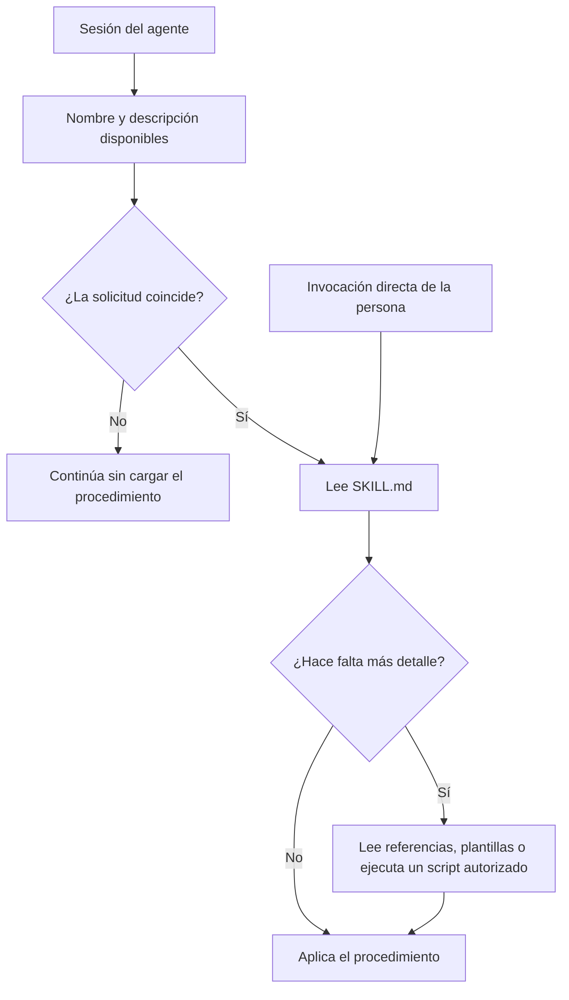

# Skills: qué son, cuándo te sirven y cuándo son puro ruido

## Qué vas a entender

Una **skill** es un manual de procedimientos que el agente consulta cuando el trabajo lo amerita. Imaginá que un empleado nuevo llega al equipo: puede ver el índice de manuales, pero no hace falta poner todos los manuales abiertos sobre el escritorio. El agente reconoce una descripción y, cuando decide usar esa skill o vos la invocás, recibe sus instrucciones. *(docs-oficiales: [Claude Code](https://code.claude.com/docs/en/skills), [Codex](https://developers.openai.com/codex/skills), [estándar Agent Skills](https://agentskills.io/specification)).*

Claude Code recomienda crear una skill cuando repetís las mismas instrucciones o pasos, o cuando una sección de `CLAUDE.md` ya se convirtió en un procedimiento. La idea general también aplica a Codex: una skill describe un flujo reutilizable, aunque cada producto interpreta su formato y sus campos. *(docs-oficiales: [Claude Code](https://code.claude.com/docs/en/skills), [Codex](https://developers.openai.com/codex/skills)).*

El valor de una skill depende de que resuelva un procedimiento que necesitás, que la descripción ayude al agente a elegirla y que el resultado mejore. Agregar skills sin evaluar puede ocupar el espacio del contexto y dificultar la selección. Esta última relación es una **inferencia práctica** basada en cómo se cargan listados y cuerpos; no es una garantía de que toda colección grande falle.

## Anatomía de una skill

Una skill suele ser una carpeta con un archivo `SKILL.md`. Puede incluir material de consulta, plantillas o scripts de apoyo. El formato Agent Skills requiere un frontmatter YAML seguido de instrucciones en Markdown; los detalles adicionales varían por herramienta. *(docs-oficiales: [formato Agent Skills](https://agentskills.io/specification), [skills Claude Code](https://code.claude.com/docs/en/skills), [skills Codex](https://developers.openai.com/codex/skills)).*

```text
preparar-minuta/
├── SKILL.md              # descripción e instrucciones principales
├── references/           # lectura de apoyo, si hace falta
└── assets/               # plantillas u otros materiales, si hacen falta
```

Ejemplo mínimo. Los comentarios explican cada línea del encabezado:

```markdown
---
name: preparar-minuta # nombre corto; identifica esta skill
description: >- # explica qué hace y cuándo usarla
  Prepara una minuta a partir de notas de reunión. Usar cuando pidan
  ordenar acuerdos, responsables y pendientes de una reunión.
---

# Preparar una minuta

Ordená las notas en acuerdos, responsables y pendientes.
No inventés información que no aparezca en las notas.
Marcá cualquier dato faltante para que la persona lo complete.
```

El nombre y la descripción funcionan como rótulo del manual. El cuerpo explica el procedimiento. En Claude Code, `description` ayuda a decidir cuándo cargarlo; Codex también usa `name` y `description` para encontrar skills pertinentes. *(docs-oficiales: [frontmatter de Claude Code](https://code.claude.com/docs/en/skills), [creación de skills en Codex](https://developers.openai.com/codex/skills)).*

## Las tres capas de carga



**Índice.** En Claude Code, la lista incluye nombres y descripciones para las skills que pueden activarse; si el presupuesto del listado se queda corto, puede recortar descripciones y quitar palabras clave que ayudaban al disparo. En Codex, la lista inicial incluye nombre, descripción y ruta; si está muy cargada, puede acortar descripciones o dejar skills fuera del listado inicial. El comportamiento exacto depende del producto y su versión. *(docs-oficiales: [Claude Code: descripciones recortadas](https://code.claude.com/docs/en/skills), [Codex: carga progresiva](https://developers.openai.com/codex/skills)).*

**Cuerpo.** Se incorpora al contexto cuando se usa la skill. Claude Code mantiene el contenido invocado en el contexto de la conversación; al resumirla puede volver a incorporar contenido reciente. Por eso conviene escribir instrucciones concisas. Codex también lee el cuerpo cuando selecciona una skill. *(docs-oficiales: [ciclo de contenido de Claude Code](https://code.claude.com/docs/en/skills), [Codex](https://developers.openai.com/codex/skills)).*

**Archivos de apoyo.** Una skill puede referirse a más detalle que el agente consulta según la tarea. Un script no es solo texto: puede ejecutar acciones. Si el agente lee un archivo de referencia, ese contenido pasa a su contexto de trabajo. *(docs-oficiales: [estructura Agent Skills](https://agentskills.io/specification), [archivos de apoyo en Claude Code](https://code.claude.com/docs/en/skills)).*

## Por qué muchas skills pueden volverse ruido

Hay tres costos distintos:

1. **El listado ocupa espacio desde el inicio.** Aunque todavía no se use el cuerpo, el agente necesita un inventario para saber qué podría invocar. *(docs-oficiales: [Claude Code](https://code.claude.com/docs/en/skills), [Codex](https://developers.openai.com/codex/skills)).*
2. **Las descripciones pueden quedar recortadas.** Si desaparecen las palabras clave útiles, una skill relevante puede no seleccionarse. Skills con descripciones casi iguales también dan señales ambiguas; que esa similitud cause una elección equivocada es una inferencia, no un resultado garantizado. *(docs-oficiales para el recorte; inferencia para el solape: [Claude Code](https://code.claude.com/docs/en/skills), [Codex](https://developers.openai.com/codex/skills)).*
3. **El cuerpo permanece en el trabajo en curso.** En Claude Code las instrucciones invocadas continúan en el contexto entre turnos y pueden reincorporarse tras resumir la conversación. Si varias skills agregan pasos parecidos o largos, consumen atención además de espacio. *(docs-oficiales: [ciclo de contenido](https://code.claude.com/docs/en/skills)).*

La conclusión práctica es **medir el conjunto que tenés y conservar lo que aporta**. La cantidad por sí sola no demuestra si una skill sirve o estorba.

## ¿Necesitás una skill?

Usá este árbol como guía editorial; la pregunta sobre repetición frecuente es una heurística, no una regla técnica del fabricante.

1. ¿Repetís la misma tarea o las mismas instrucciones con frecuencia?
   - **No:** usá una instrucción en el chat o una plantilla cuando la necesités.
   - **Sí:** seguí.
2. ¿Es un procedimiento con pasos, entradas y resultado, en vez de un dato fijo del proyecto?
   - **No:** guardá el dato en `CLAUDE.md` o `AGENTS.md`, según la herramienta, o en la documentación del equipo.
   - **Sí:** seguí.
3. ¿Probaste hacerlo sin skill y el resultado quedó inconsistente o costó repetirlo?
   - **No:** primero observá el flujo actual y anotá qué se repite.
   - **Sí:** una skill puede ayudar; compará su resultado con la línea base.
4. ¿La necesitás vos o todo el equipo?
   - **Solo vos:** mantenela en el alcance personal o invocala manualmente.
   - **Todo el equipo:** proponé una skill compartida y evalúenla con casos reales antes de adoptarla.

Quizá te sirva más una sola línea en las instrucciones del proyecto, una plantilla, un script para pasos deterministas, una CLI existente o un hook para una acción que debe ocurrir en un evento. Una skill orienta un proceso; no convierte automáticamente un proceso en determinista.

## Skills sueltas, paquetes, plugins y catálogos

Una **skill suelta** es un procedimiento concreto. Un **paquete** puede agrupar varias skills relacionadas. Un **plugin** puede distribuir skills junto con otros componentes, como conexiones o hooks, según el producto. Un **catálogo o marketplace** es un lugar para descubrir paquetes; el catálogo completo no es la unidad que necesitás para resolver una tarea. *(docs-oficiales: [plugins Claude Code](https://code.claude.com/docs/en/plugins/overview), [plugins Codex](https://learn.chatgpt.com/docs/plugins)).*

<AntesDeInstalar que="Antes de agregar una skill o un plugin, revisá qué problema resuelve, qué archivos y scripts trae, qué accesos solicita y cómo desactivarlo." />

La pregunta útil es **“¿qué trae exactamente?”**: abre el `SKILL.md`, revisá instrucciones, scripts y referencias, y comprobá el origen. Conservá la skill concreta que resolviste evaluar; no hace falta añadir un catálogo entero para tener una opción disponible. *(docs-oficiales: [estructura Agent Skills](https://agentskills.io/specification), [seguridad de plugins Claude Code](https://code.claude.com/docs/en/plugins/security)).*

## Medilo vos mismo

En Claude Code, `/context` muestra cuánto ocupa el listado de skills después de aplicar su presupuesto. Compará una sesión nueva antes y después de habilitar o deshabilitar una skill. El menú `/skills` permite revisar el estado; `/doctor` estima el costo del listado y sus mayores contribuyentes. `/skill-doctor` informa costo y frecuencia de uso de skills, y señala skills del listado que nunca se invocaron, con indicaciones para apagarlas. Este último requiere una versión compatible y que la sesión pueda obtener la función. *(docs-oficiales: [comandos y skills Claude Code](https://code.claude.com/docs/en/skills), [referencia de comandos](https://code.claude.com/docs/en/commands)).*

<MideTuMismo comando="Claude Code: /context (repetí en una sesión nueva antes y después)" queMirar="Anotá el renglón Skills y cualquier cambio en las descripciones disponibles. En Codex, revisá /skills para confirmar nombre, descripción y ruta; esta vista no equivale a la medición cuantitativa de /context." />

Si una skill está disponible pero casi nunca se usa, primero averiguá por qué. En Claude Code podés dejar solo el nombre (`name-only`), limitarla a invocación de la persona (`user-invocable-only`) o apagarla (`off`) desde `/skills` o `skillOverrides`. `on` conserva nombre y descripción. Las skills incluidas por plugins se administran desde `/plugin`, no con `skillOverrides`. En Codex, `allow_implicit_invocation: false` impide que el modelo la elija automáticamente, pero permite invocación explícita; `[[skills.config]]` con `enabled = false` la desactiva sin borrar la carpeta. *(docs-oficiales: [Claude Code](https://code.claude.com/docs/en/skills), [Codex](https://developers.openai.com/codex/skills)).*

Claude Code documenta además los ajustes `skillListingBudgetFraction`, `SLASH_COMMAND_TOOL_CHAR_BUDGET` y `skillListingMaxDescChars`, relacionados con el presupuesto y el recorte del listado. Son opciones avanzadas: antes de cambiarlas, revisá la referencia de [configuración](https://code.claude.com/docs/en/settings-reference) para tu versión; normalmente es más sencillo acortar descripciones o desactivar lo que no necesitás. *(docs-oficiales: [skills Claude Code](https://code.claude.com/docs/en/skills), [referencia de configuración](https://code.claude.com/docs/en/settings-reference)).*

**Observación ejecutada — 2026-09-30.** En Claude Code `2.1.285`, ejecuté `claude plugin details commit-commands@claude-code-plugins` con una configuración temporal y un plugin del marketplace oficial `claude-code-plugins`. La salida estimó `Always-on: ~71 tok` y mostró estimaciones por componente. Es una estimación del plugin consultado en esa versión, no un costo universal ni una predicción para otra instalación. **Ejemplo reportado — 2026-09-30:** el encargo menciona una estimación de 403 tokens para otro plugin; no la reproduje en esta consulta, así que queda como dato reportado del pedido y no como medición propia.

## Escribí una descripción que ayude a elegir

Una descripción útil comunica **qué hace**, **cuándo usarla** y cuáles son sus límites principales. Poné primero las palabras que una persona diría al pedir esa tarea; preferí una habilidad concreta a frases amplias como “ayuda con documentos”. Codex y Claude Code documentan que el texto de descripción contribuye a la selección automática y que puede recortarse cuando el listado compite por espacio. *(docs-oficiales: [Claude Code](https://code.claude.com/docs/en/skills), [Codex](https://developers.openai.com/codex/skills), [Agent Skills](https://agentskills.io/specification)).*

Para evaluar la descripción de **preparar-minuta**, armá solicitudes realistas y empezá cada caso en una sesión nueva. Estas son ideas para comprobar:

| Deberían activar la skill | No deberían activarla |
| --- | --- |
| “Ordená estas notas de reunión en acuerdos, responsables y pendientes.” | “Resumí esta noticia en dos oraciones.” |
| “Convertí estos apuntes de la reunión en una minuta.” | “Traducí este correo al inglés.” |
| “Separá lo que decidimos de las tareas que quedaron abiertas.” | “Ayudame a elegir una fecha para la próxima reunión.” |
| “Sacá responsables y acuerdos de esta transcripción ficticia.” | “Redactá un saludo de cumpleaños para una compañera.” |
| “Prepará una minuta con estas notas, sin completar los datos que faltan.” | “Explicame qué significa la palabra ‘quórum’.” |

Compará si se activó donde correspondía y si el resultado fue mejor con la skill que sin ella. Los casos negativos ayudan a descubrir descripciones demasiado generales. La evaluación oficial recomienda comparar prompts con la skill y sin ella en contextos nuevos. *(docs-oficiales: [evaluación de Agent Skills](https://agentskills.io/skill-creation/evaluating-skills), [evaluación de Claude Code](https://code.claude.com/docs/en/skills)).*

## Quién puede invocarla

En Claude Code, el comportamiento predeterminado permite invocación manual y automática. `disable-model-invocation: true` deja la activación en manos de la persona y evita anunciar la descripción al modelo. `user-invocable: false` quita la invocación manual, pero permite que Claude la use como conocimiento de apoyo. No son opciones equivalentes. *(docs-oficiales: [control de invocación](https://code.claude.com/docs/en/skills)).*

Elegí la invocación manual para acciones sensibles o con efectos externos que querés iniciar conscientemente. Para una guía de conocimiento que el modelo debería consultar cuando resulte pertinente, `user-invocable: false` puede ser más apropiado. Aun así, los permisos generales deben limitar las herramientas; esconder una skill del menú no es un control de seguridad.

Codex permite indicar `allow_implicit_invocation: false` en su configuración de skill para que no la elija implícitamente. Todavía podés mencionarla de forma explícita con `$nombre-de-skill`. Revisá los campos específicos del cliente: los frontmatter no son idénticos en todos los productos. *(docs-oficiales: [Codex](https://developers.openai.com/codex/skills), [Agent Skills](https://agentskills.io/specification)).*

## Seguridad: instrucciones, herramientas y scripts

Una skill es contenido que orienta al agente, no una frontera de seguridad. `allowed-tools` en Claude Code puede autorizar herramientas durante el turno de invocación, sin una solicitud de permiso por cada uso; las reglas de denegación siguen prevaleciendo. Las skills de proyecto también pueden aplicar esa autorización aunque no hayas confiado antes en la carpeta. Revisá ese campo antes de usar una skill compartida. *(docs-oficiales: [preaprobación de herramientas en Claude Code](https://code.claude.com/docs/en/skills), [permisos](https://code.claude.com/docs/en/permissions)).*

Claude Code permite que una skill incluya comandos con la sintaxis `!` para traer información al cargarla; esos comandos se ejecutan en el entorno de la sesión. Una skill también puede incluir scripts. Inspeccioná el contenido y el origen antes de ejecutarla, usá datos de práctica y mantené los permisos acotados. Para ampliar la revisión de paquetes, consultá la sección de seguridad del [mapa del entorno de un agente](/guias/mapa-del-entorno-de-un-agente) y la [guía para evaluar antes de instalar](/guias/antes-de-instalar-evaluar-con-criterio). *(docs-oficiales: [comandos inyectados en Claude Code](https://code.claude.com/docs/en/skills), [seguridad de plugins](https://code.claude.com/docs/en/plugins/security)).*

Codex también admite que una skill contenga scripts y otros recursos; antes de usarlos, revisá el archivo y las herramientas o conexiones que requieren. Para los límites de ejecución y aprobación, consultá [seguridad y aprobaciones de Codex](https://learn.chatgpt.com/docs/agent-approvals-security). *(docs-oficiales: [comandos inyectados en Claude Code](https://code.claude.com/docs/en/skills), [seguridad de plugins Claude Code](https://code.claude.com/docs/en/plugins/security), [skills Codex](https://developers.openai.com/codex/skills), [aprobaciones de Codex](https://learn.chatgpt.com/docs/agent-approvals-security)).*

## Seguí aprendiendo

- [El mapa del entorno de un agente](/guias/mapa-del-entorno-de-un-agente)
- [Qué es un agente de IA](/guias/que-es-un-agente-de-ia) — límites, permisos y uso responsable.
- [Qué es el contexto y cómo cuidarlo](/guias/contexto-que-es-y-como-cuidarlo)
- [Skills para agentes en QGIS](/guias/qgis-skills-para-agentes) — ejemplo aplicado a una herramienta específica.

## Qué deberías poder hacer ahora

- Explicar con tus palabras por qué el índice de skills ya puede ocupar contexto antes de cargar un procedimiento.
- Elegir entre instrucciones del proyecto, plantilla, script, CLI, hook y skill para un caso cotidiano.
- Preparar solicitudes que deberían y no deberían activar una skill, y comparar resultados con y sin ella.

## Mitos frecuentes

<MitoRealidad mito="Cuantas más skills agrego, más capaz se vuelve mi agente." realidad="Las skills aportan procedimientos concretos, pero sus listados pueden competir por contexto y sus descripciones por la selección. Medí qué aporta cada una." fuente="Claude Code y Codex; docs-oficiales." />

Las plataformas describen el listado y la carga de instrucciones progresiva en [Claude Code](https://code.claude.com/docs/en/skills) y [Codex](https://developers.openai.com/codex/skills).

<MitoRealidad mito="Muchas descargas o estrellas prueban que una skill me servirá." realidad="La popularidad no demuestra que coincida con tu procedimiento, herramientas o permisos. Probala con tareas reales de tu trabajo." fuente="Inferencia práctica; evaluación de Agent Skills." />

La guía oficial explica cómo comparar una skill con la línea base en [Agent Skills](https://agentskills.io/skill-creation/evaluating-skills).

<MitoRealidad mito="Las skills no cuestan nada hasta que se usan." realidad="El índice y sus descripciones pueden ocupar contexto antes de abrir el cuerpo; el cuerpo se incorpora al invocarse." fuente="Claude Code y Codex; docs-oficiales." />

La carga progresiva se explica en [Claude Code](https://code.claude.com/docs/en/skills) y [Codex](https://developers.openai.com/codex/skills).

<MitoRealidad mito="Una skill garantiza que el agente siempre la siga." realidad="Una skill aporta instrucciones y no garantiza el resultado. Medí si se activa donde corresponde; para acciones obligatorias ante eventos, evaluá un hook con controles adecuados." fuente="Inferencia; documentación oficial de skills y hooks." />

Consultá la documentación de [skills](https://code.claude.com/docs/en/skills) y [hooks](https://code.claude.com/docs/en/hooks-guide).
